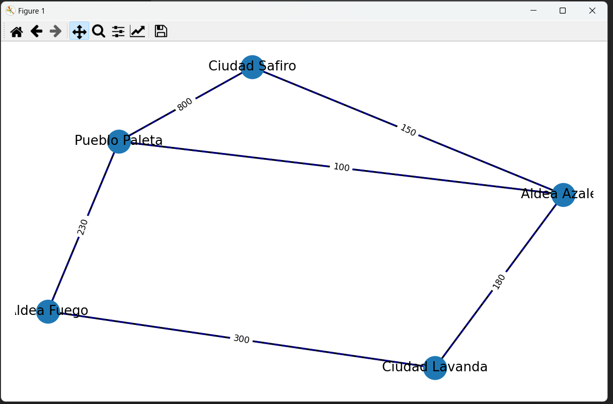

# Hoja de Trabajo #9

### Autor: Carlos Villagrán, carné 22264

## Descripción del proyecto:

El siguiente proyecto consta de la creación de grafos para la simulación de las conecciones entre aldeas de una región. Las aldeas se encuentran a cierta distancia unas de otras, esto se ve representado en el peso que tienen las conecciones entre los nodos del grafo. Se trabaja con un grafo bidireccional haciendo uso de la librería networkx en python. El grafo se gráfica con ayuda de matplotlib. 

## Ejemplo de uso:

El programa busca un archivo llamado "rutas.txt" en la misma ruta que los .py, el archivo está escrito de la siguiente manera (se recomienda el uso de este archivo para la prueba):

```textile
Pueblo Paleta, Aldea Azalea, 100
Aldea Azalea, Ciudad Safiro, 150
Pueblo Paleta, Ciudad Safiro, 800
Ciudad Lavanda, Aldea Fuego, 300
Pueblo Paleta, Aldea Fuego, 230
Ciudad Lavanda, Aldea Azalea, 180 
```

El programa devolverá la ruta más corta a partir de la aldea en la que se encuentra y hacia la que se dirige, ejemplo:

```textile
Bienvenido al asistente de mapa para la región.
¿Dónde te encuentras actualmente? (Ingresa la aldea): Aldea Azalea

Ingresa la aldea de destino: Aldea Fuego

La mejor trayectoria desde Aldea Azalea hasta Aldea Fuego es:
Distancia: 330
Trayectoria en orden: ['Aldea Fuego', 'Pueblo Paleta', 'Aldea Azalea']

```

En el ejemplo anterior se va de la Aldea Azalea hacia la Aldea Fuego, el camino más corto tiene un peso de 330, distancia, y el recorrido es pasando por "Pueblo Paleta". El programa también permite observar gráficamente el grafo:

```textile
¿Quieres observar el mapa? (Sí = 1, No = 0): 1
```

<div>

</div>

En el grafo se observa que la trayectoria más corta es en efecto la sugerida por el algoritmo. 
